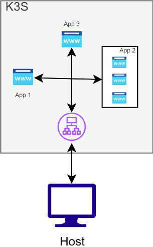

# Inception Of Things
**Inception Of Things** is a Kubernetes‑based project exercise from the **42 school**, designed to demonstrate orchestration, CI/CD pipelines, and deployment automation using tools like **Vagrant**, **Helm**, **GitHub**, and **GitLab (CI/CD)**.

---

##  Table of Contents

1. [Overview](#overview)
2. [Prerequisites](#prerequisites)  
3. [Project Structure](#project-structure)

4. [Part 1: K3s and Vagrant](#part-1-k3s-and-vagrant)
   - [Objective - Part 1](#objective---part-1)
   - [Requirements - Part 1](#requirements---part-1)
   - [Network Configuration](#network-configuration)
   - [K3s Installation](#k3s-installation)
   - [Vagrantfile Example(Conceptual)](#vagrantfile-example-conceptual)
5. [Part 2: K3s and Three Simple Applications](#part-2-k3s-and-three-simple-applications)
   - [Objective - Part 2](#objective---part-2)
   - [Requirements - Part 2](#requirements---part-2)
   - [Access Behavior](#access-behavior)
6. [Part 3: K3d and Argo CD](#part-3-k3d-and-argo-cd)
   - [Objective - Part 3](#objective---part-2)
   - [Requirements - Part 3](#requirements)
   - [Cluster Structure](#cluster-structure)
   - [GitHub Repository](#github-repository)
7. [Bonus](#Bonus)
    - [Setup Instructions](#setup-instructions-bonus)

---

## Overview

This project replicates a production-like microservices architecture using Kubernetes. It’s built with:

- **Vagrant**: to bring up your virtual machines quickly and consistently.  
- **Kubernetes**: to manage containerized services.  
- **Helm**: to simplify deployment.  
- **GitHub / GitLab**: act as Git repositories to store and version infrastructure and application manifests.
- **ArgoCD**: handles the continuous delivery (CD) by syncing the desired state from Git to the Kubernetes cluster.

Each component follows best practices in infrastructure as code (IaC) and continuous deployment.

---

## Prerequisites

Ensure you have the following installed **locally**:

- [Vagrant](https://www.vagrantup.com/) >= 2.2.x  
- [VirtualBox](https://www.virtualbox.org/)
- [kubectl](https://kubernetes.io/docs/tasks/tools/)  
- [Helm](https://helm.sh/) >= 3.x  
- [Git](https://git-scm.com/)  
- [Docker](https://www.docker.com/)
- [Argocd](https://argo-cd.readthedocs.io/en/stable/)
- [K3d](https://k3d.io/stable/)

The script check.sh in p3/ provide:
- kubectl
- helm
- k3d
- argocd

On your remote environment / CI runners, you'll need:

- Access to GitHub and/or GitLab  

---

## Project Structure

```text
├── p1/
│   └── VagrantFile                # Defines VMs to simulate a multi-node cluster(Master + Agent)
│   └── scripts/
│       └── configS.sh             # Installs k3s and initializes the Master node
│       └── configSW.sh            # Installs k3s and joins node as Agent (Worker)
│
├── p2/
│   └── Vagrantfile                # Launches a single VM for application deployment
│   └── confs/
│       └── app1.yaml              # Kubernetes manifest for application 1 (Deployment + Service)
│       └── app2.yaml              # Kubernetes manifest for application 2 (Deployment + Service)
│       └── app3.yaml              # Kubernetes manifest for application 3 (Deployment + Service)
│       └── ingress.yaml           # Ingress configuration to expose apps via HTTP routing
│   └── scripts/
│       └── configS.sh             # Sets up k3s, applies app manifests and ingress
│
├── p3/
│   └── Makefile                   # Automates validation and launch of previous parts
│   └── scripts/
│       └── check.sh               # Verifies cluster status and resource availability
│       └── setup.sh               # Automates k3s setup and manifest application
│
├── bonus/
│   └── Makefile                   # Automates GitLab installation and configuration
│   └── confs/
│       └── application.yaml       # GitLab-specific Helm configuration values
│       └── deployment.yaml        # Custom GitLab deployment (if needed)
│       └── gitlab_values.yaml     # Helm values for GitLab deployment
│       └── ingress.yaml           # Ingress rules for GitLab web interface
│       └── service.yaml           # GitLab service exposure configuration
│   └── scripts/
│       └── apply.sh               # Applies GitLab configuration using Helm/Kubectl
│       └── install_gitlab.sh      # Installs GitLab via Helm and configures it
│
├── README.md                      # Project documentation: setup, usage, explanations
```

---

## Part 1: K3s and Vagrant

### Objective - Part 1

In this first part of the project, you will set up a minimal Kubernetes cluster using **K3s** across **two virtual machines** managed by **Vagrant**. The goal is to create a lightweight master/agent (server/worker) topology using modern provisioning practices.


### Requirements - Part 1

- You must create **two virtual machines** using Vagrant.
- Use the **latest stable version** of the Linux distribution of your choice (e.g., Ubuntu, Debian, AlmaLinux...).
- Allocate minimal resources:
  - **1 CPU**
  - **512 MB or 1024 MB RAM**
- Machines must be named after a team member’s login:
  - **Server**: `<login>S` (e.g., `wilS`)
  - **Worker**: `<login>SW` (e.g., `wilSW`)


### Network Configuration

Each machine must be assigned a static IP address on the **private network**:

| Machine       | Hostname | IP Address       | Role      |
|---------------|----------|------------------|-----------|
| Server        | `wilS`   | `192.168.56.110` | K3s Server (Control Plane) |
| ServerWorker  | `wilSW`  | `192.168.56.111` | K3s Agent (Worker Node)    |

- SSH access must work **without password**, using Vagrant’s provisioning.
- The two machines must be able to **communicate internally** via their private IPs.


### K3s Installation

K3s must be installed on both VMs:

- On the **Server (Master)**:
  - Install K3s in **server mode**
  - Expose the K3s **token** or **join URL** so that agents can register

- On the **Worker (Agent)**:
  - Install K3s in **agent mode**
  - Use the correct **token** and **IP** to join the cluster

You can use provisioning shell scripts (`scripts/configS.sh`, `scripts/configSW.sh`) to automate the setup.


### Vagrantfile Example (Conceptual)

```ruby
Vagrant.configure("2") do |config|
  config.vm.define "wilS" do |s|
    s.vm.box = "ubuntu/focal64"
    s.vm.hostname = "wilS"
    s.vm.network "private_network", ip: "192.168.56.110"
    s.vm.provider "virtualbox" do |vb|
      vb.memory = 1024
      vb.cpus = 1
    end
    s.vm.provision "shell", path: "scripts/configS.sh"
  end

  config.vm.define "wilSW" do |w|
    w.vm.box = "ubuntu/focal64"
    w.vm.hostname = "wilSW"
    w.vm.network "private_network", ip: "192.168.56.111"
    w.vm.provider "virtualbox" do |vb|
      vb.memory = 1024
      vb.cpus = 1
    end
    w.vm.provision "shell", path: "scripts/configSW.sh"
  end
end
```
---

## Part 2: K3s and Three Simple Applications



### Objective - Part 2

This part of the project focuses on deploying multiple web applications inside a **single-node Kubernetes cluster** using **K3s**. You will set up **three web applications** and configure them to be accessible through **virtual host-based routing** (using Ingress). The routing will be based on the `HOST` header of HTTP requests.


### Requirements - Part 2

- Use **only one virtual machine** for this part.
- The VM must run the **latest stable version** of the Linux distribution of your choice.
- Install **K3s** in **server mode** on the VM.
- Deploy **three simple web applications** (e.g., static HTML apps or simple containers).
- Configure Ingress routing based on the `HOST` header.
- The applications must be accessible via the IP address: `192.168.56.110`.


### Access Behavior

| Request IP             |  HOST Header |  Expected Result         |
|------------------------|--------------|--------------------------|
| `192.168.56.110`       | `app1.com`   | Displays App 1           |
| `192.168.56.110`       | `app2.com`   | Displays App 2           |
| `192.168.56.110`       | `any other`  | Displays App 3 (default) |

---

## Part 3: K3d and Argo CD

### Objective - Part 3

In this final part, you will move away from Vagrant-based provisioning and instead use **K3d**, a lightweight wrapper to run **K3s** in Docker containers. You'll integrate **Argo CD** to demonstrate a fully functional GitOps-based deployment system, deploying a versioned application automatically from a public **GitHub** repository.


### Requirements - Part 3

- Use **K3d** to create your Kubernetes cluster inside Docker.
- No Vagrant is allowed for this part.
- Write an installation script (`setup.sh`) that:
  - Installs **Docker**
  - Installs **K3d**
  - Installs **kubectl**, **Helm**, and other required tools
  - Creates and configures the K3d cluster
  - Installs **Argo CD**
- The script must be fully executable during your defense, automating the entire environment setup from scratch.


### K3s vs K3d

| Feature      | K3s                                | K3d                                 |
|--------------|-------------------------------------|--------------------------------------|
| Runtime      | Runs directly on a VM or host       | Runs inside Docker containers        |
| Use case     | Lightweight prod/staging clusters   | Ideal for local dev & CI testing     |
| Installation | Via shell script                    | Via Docker/K3d CLI                   |
| Management   | System-level                        | Docker container-based               |


### Cluster Structure

You must create **two Kubernetes namespaces**:

| Namespace | Purpose                        |
|-----------|--------------------------------|
| `argocd`  | Contains the Argo CD system    |
| `dev`     | Contains your demo application |

Your Argo CD setup will **synchronize** with your GitHub repository and **automatically deploy** the app into the `dev` namespace.

> \$> kubectl create namespace 'name'

### GitHub Repository

- You must host a **public GitHub repository**.
- It must include your application's **Kubernetes manifests** (Deployment, Service, etc.).
- The **repository name must include the login** of one team member.
- Argo CD will use this repo to monitor and deploy the app.
- You must be able to change the **image version/tag** in the repo and see the application **update automatically**.

Example structure:

your-login/
├── k8s/
│ ├── deployment.yaml
│ ├── service.yaml
│ └── ingress.yaml

### Application Requirements

You have two options for the application:
-use a prebuilt image 
-create your own 

I choose the first one.

#### Use the Prebuilt Image

- Use Wil's image available on DockerHub:
[Wil-Playground](https://hub.docker.com/r/wil42/playground)


---
## Bonus: GitLab Integration with Argo CD and K3d

### Objective - Part Bonus

As a bonus, you will extend your existing **Part 3** setup by deploying a **local GitLab instance** inside your Kubernetes cluster. This GitLab instance will fully replace the public GitHub repository used previously, meaning:

- Your GitLab will run locally inside the cluster.
- Argo CD will be reconfigured to **pull manifests from your internal GitLab repo**.
- Everything must work **independently of GitHub**.

---

### Requirements - Part Bonus

- Deploy **the latest version of GitLab** inside your Kubernetes cluster (K3d).
- GitLab must run **inside the same cluster** (locally).
- All GitLab-related resources must be placed in a dedicated namespace named `gitlab`.
- Argo CD must be fully integrated with GitLab:
  - The Git repo used by Argo CD must now be hosted on your local GitLab instance.
  - When you push changes (e.g., image version) to GitLab, Argo CD should auto-sync and update your app in the `dev` namespace.
- This bonus setup must be included in a new folder named `bonus/` at the root of your repo.

---

### Recommended Tools

- **Helm**: to install GitLab using the official chart
- **K3d**: Kubernetes in Docker (already used in Part 3)
- **Argo CD**: to automate deployment from GitLab
- **Ingress Controller**: to expose GitLab UI (e.g., Traefik)

---